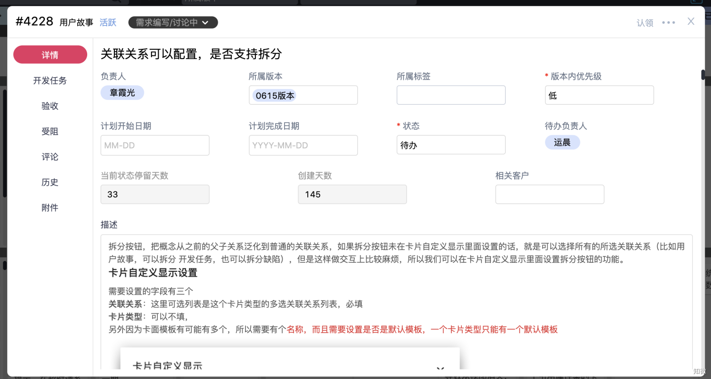

# 卡片

### **卡片是什么？**

一张卡片即是一个任务，一件事情。

### **卡片能够做什么？**

每一张卡片都有一个详情页，可以对卡片进行描述。

**详情：**您可以尽可能详细地描述这张卡片的具体内容，每一张卡片都能够指定负责人。

**卡片关联：**不同卡片类型之间可以建立关联关系。

**评论：**可以随时随地对卡片进行讨论，甚至可以@成员及时查看。

**阻塞：**卡片在执行过程中遇到的阻碍，可以添加阻塞并求助相关成员，阻塞自动标红，让问题足够醒目。

**卡片历史：**记录从创建之后卡片所经历的所有操作。

**附件：**在卡片中上传文件，让文件和卡片统一管理。

**认领：**认领卡片，能够快速将负责人改为当前用户。

**丢弃：**当卡片不再被需要的时候，您可以将其丢弃，还可以注明丢弃原因，当然，您也可以在丢弃区将其找回还原。

**归档：**当卡片已经完成了之后，您可以将其归档，当然，您也可以在归档区将其找回还原。

